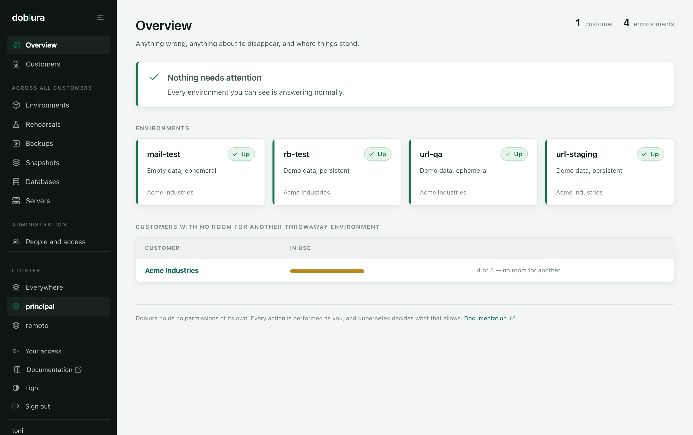
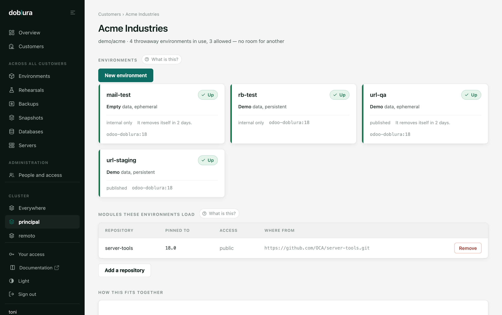
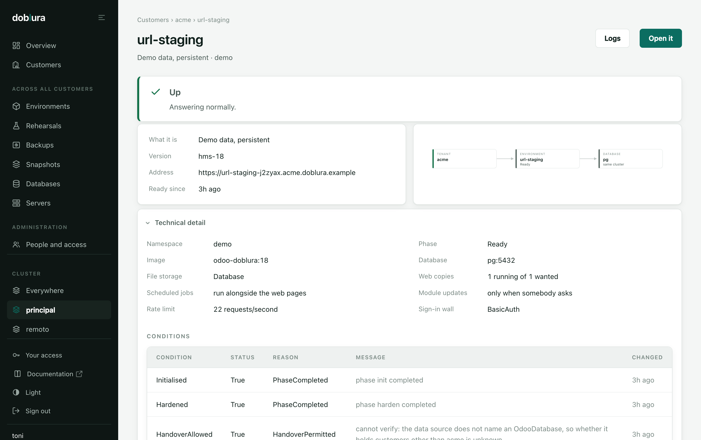
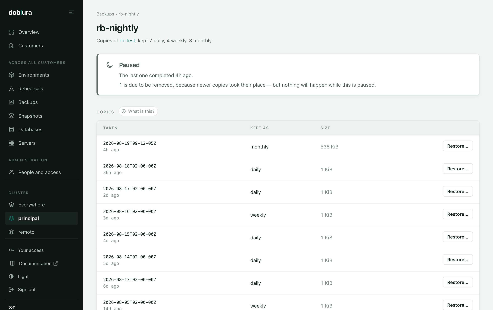

<p align="center">
  <picture>
    <source media="(prefers-color-scheme: dark)" srcset="docs/logo-dark.png">
    
  </picture>
</p>

<p align="center">
  <b>Rehearse your Odoo migration before it becomes irreversible.</b><br>
  <sub>A Kubernetes operator for the Odoo delivery lifecycle.</sub>
</p>

<p align="center">
  <a href="LICENSE"></a>
  
  
  
</p>

---

> **doblura** *(n.)* — from *doble*, the stunt double: the stand-in who takes the
> fall so the star does not have to. Which is precisely what an anonymized copy
> of production is for.

An Odoo `-u` alters the database schema and **has no downgrade**. There is no
canary, no blue/green, no rollback: the only way back is restoring a backup.
And the failures do not show up with demo data — they show up on the odd journal
entry somebody created in 2019.

The only way to know whether a migration works is to run it against the real
data before running it against the real data.

```yaml
apiVersion: doblura.dev/v1alpha1
kind: OdooRehearsal
metadata:
  name: release-17-0-3
spec:
  image: ghcr.io/acme/odoo@sha256:abc...      # the exact artifact bound for prod
  snapshot:
    from:
      type: Volume
      volume: {claimName: prod-anon-dump}     # neutralize: true by default
  database:
    host: pg-rw.db.svc
    user: odoo
    passwordSecret: pg-app
  budget:
    maxUpgradeDuration: 2h                    # your maintenance window
  assertions:
    modelCounts:
      - {model: account.move, minCount: 1000}
      - {model: res.partner}
```

```console
$ kubectl get rehearsal
NAME             PHASE       UPGRADE   BUDGET   AGE
release-17-0-3   Failed      4h12m     2h       4h13m

$ kubectl get rehearsal release-17-0-3 -o jsonpath='{.status.message}'
the migration took 4h12m0s, over the budget of 2h:
this release does not fit the maintenance window
```

The migration **finished cleanly**. And the release still is not viable. Those
are two different facts, and Doblura tells them apart.

---

## Why this exists

Almost every piece you need to deliver Odoo sanely already has a good public
tool:

| Piece | Tool |
| --- | --- |
| Per-PR environments | [runboat](https://github.com/sbidoul/runboat) |
| Repository bot | [oca-github-bot](https://github.com/OCA/oca-github-bot) |
| Versioned migrations | [marabunta](https://github.com/camptocamp/marabunta) |
| Database utilities | [click-odoo-contrib](https://github.com/acsone/click-odoo-contrib) |
| Image | [OCB](https://github.com/OCA/OCB) |
| Per-project docker setup | [doodba](https://github.com/Tecnativa/doodba) |
| Anonymization | [greenmask](https://github.com/greenmaskio/greenmask) |
| **Migration rehearsal** | **— nothing** |

A commercial equivalent does exist: Odoo.sh's *Test Upgrade* mode, which
restores the already-upgraded backup on every push. That Odoo charges for it is
the proof that the problem is real. Doblura is that piece, self-hosted.

## The three things it measures

1. **Does it finish?** The `-u` completes without an exception.
2. **How long does it take?** This is the number you plan the window with.
   Without it, the rehearsal cannot support a decision.
3. **Is the data still there?** `search_count` over the critical models after
   the migration. It sounds trivial and it catches serious things: a `-u` can
   exit 0 and leave a table unreachable.

## Budget ≠ timeout

A timeout is hygiene: it kills something that hung. A **budget** is a business
assertion. If the `-u` takes longer than your window, the release is not viable
even though it technically worked.

Which is why they are two fields and two separate conditions:

```yaml
budget:
  maxUpgradeDuration: 2h    # exceeding it FAILS the rehearsal
  hardTimeout: 6h           # exceeding it KILLS it (default)
```

```console
$ kubectl get rehearsal release-17-0-3 -o jsonpath='{range .status.conditions[*]}{.type}={.status}{"\n"}{end}'
Restored=True
Migrated=True         # the migration did finish
WithinBudget=False    # but it does not fit the window
Succeeded=False
```

---

## Addons are never copied into a volume

The usual antipattern is baking addons into the image and then, on startup,
copying them into a volume "so they persist". That breaks three ways:

1. The copy runs on **every startup**. With hundreds of modules that is minutes
   before Odoo listens, and the probes kill the pod first.
2. If the volume already had content, the copy either overwrites or merges it,
   and you end up running a combination of two versions that exists in no
   commit.
3. With more than one replica, two pods copy into the same volume at once.

Doblura **never copies addons**. Three read-only sources, freely combined:

```yaml
addons:
  edition: Enterprise
  precedence: ExternalFirst            # who wins if a module is in two places

  baked: ["/opt/odoo/addons-custom"]   # already in the image: read WHERE THEY ARE

  repos:                               # init container → ephemeral emptyDir
    - name: odoo-enterprise
      url: https://github.com/odoo/enterprise
      ref: "17.0"
      auth: {type: GitHubApp, secretRef: gh-app}
    - name: oca-account
      url: https://github.com/OCA/account-financial-tools
      ref: 5f2c1a9                     # a commit, not a branch: reproducible

  volume:                              # a PVC another process populates, ReadOnly
    claimName: aggregated-addons
```

The operator **composes** the addons path and leaves it visible in a ConfigMap:

```console
$ kubectl get cm release-17-0-3-odoo-conf -o jsonpath='{.data.odoo\.conf}' | head -2
[options]
addons_path = /mnt/addons-repos/odoo-enterprise,/mnt/addons-repos/oca-account,/opt/odoo/addons-custom
```

That line is the first question whenever a module "does not load", and here the
answer is a `kubectl get` rather than archaeology.

> **Why it matters in a rehearsal:** `click-odoo-update` decides what to update
> from the checksum of the modules it **sees** on the addons path. If the
> rehearsal's addons path is not production's, you are rehearsing a different
> migration.

## Private repos: four mechanisms, all explicit

"Private" is not one thing, it is four, and every forge pushes you towards a
different one. Doblura does not infer it from the Secret's keys: when that fails
the message is `authentication failed` and you lose an afternoon.

| `auth.type` | Secret keys | For |
| --- | --- | --- |
| `Token` | `token` | GitHub PAT, GitLab access token, Gitea token |
| `BasicAuth` | `username`, `password` | GitLab deploy tokens, Bitbucket app passwords |
| `SSHKey` | `ssh-privatekey`, `known_hosts` | Deploy keys |
| `GitHubApp` | `appID`, `installationID`, `privateKey` | Organisations |

**Use GitHubApp if you can.** Per-repository permissions, auditable, revocable
without touching anyone, and not tied to a person. A personal PAT in a pipeline
is a time bomb: the day its owner leaves the company the token is revoked and the
rehearsal stops working, right when nobody remembers why.

Doblura mints the installation token itself (RS256 JWT → installation token) and
leaves it in an ephemeral Secret it owns, garbage-collected with the rehearsal.
It accepts the private key as PKCS#1 or PKCS#8, because it arrives as one or the
other depending on where you got it.

Credentials travel through `credential.helper` at run time, never embedded in the
URL — so they never land in `.git/config`. And all git output passes through a
filter that obfuscates the userinfo.

---

## Snapshots: generic first, provider second

Every provider, however unusual, reduces to the same internal contract:

> **leave a dump at `/snapshot` and exit 0**

That is all. One container, one path, one exit code.

| `from.type` | How | Covers |
| --- | --- | --- |
| `Volume` | mounts a PVC, no download | the recommended path |
| `ObjectStore` | rclone, S3 protocol | AWS, MinIO, Ceph, R2, Wasabi, B2, Spaces |
| `HTTP` | curl with `--fail` | internally published dumps |
| `Custom` | **your container** | everything else |

`ObjectStore` is deliberately generic: **there is no type per cloud**, because it
is the same protocol. One type for AWS and another for MinIO would be the same
code five times over and still fall short on the sixth.

And `Custom` is not a second-class escape hatch: it is **the same mechanism** the
built-ins use. If your backup lives on an NFS appliance, in Bacula, or behind a
proprietary API from 2004, Doblura does not need to know:

```yaml
snapshot:
  from:
    type: Custom
    custom:
      image: internal.registry/fetch-backup:3
      command: [/bin/sh, -euc]
      args:
        - |
          LATEST=$(ls -1t /mnt/nfs-backups/odoo/*.dump | head -1)
          cp "$LATEST" /snapshot/dump
      envFromSecrets: [appliance-creds]
      extraVolumeClaims: [nfs-backups]   # mounted ReadOnly
  format: PgDump
```

That the built-ins are expressible through the extension point is the proof the
abstraction holds. When a native GCS or Azure provider arrives it will be **a
preset filling in this contract**, not a parallel code path.

### Format is a separate axis

Where the bytes come from and how they are packaged are different questions, and
mixing them produces a `provider × format` explosion:

| `format` | Restored with | Neutralized with |
| --- | --- | --- |
| `OdooBackup` | `click-odoo-restoredb` | `--neutralize` (and it brings the filestore) |
| `PgDump` | `pg_restore` | `odoo neutralize` afterwards |
| `PgPlain` | `psql` | `odoo neutralize` afterwards |

`OdooBackup` is the default because it includes **the database and the filestore
from the same moment**. Restoring a database without its filestore leaves
orphaned attachments, and that breaks migrations in confusing ways.

---

## The database can live outside, without the workload holding the key

`spec.database.proxy` puts pgbouncer in the pod, as a native sidecar, with the
credential Secret mounted into **that container and nowhere else**:

```yaml
spec:
  database:
    host: postgres.internal.example.com   # anywhere: managed, on-prem, another cluster
    port: 5432
    user: odoo
    passwordSecret: prod-db
    proxy:
      mode: Sidecar
      image: edoburu/pgbouncer:1.25
      poolMode: Session
```

Odoo then connects to `127.0.0.1` with no password at all. Containers in a pod
share a network namespace and not a filesystem, so the Odoo container has no
`PGPASSWORD`, cannot read the file the sidecar reads, and its `odoo.conf` says
`db_host = 127.0.0.1` — it does not learn the address it is being forwarded to.
The operator never reads the password either: pgbouncer's configuration is
generated inside the pod, from the mounted file, into a `tmpfs`.

**`poolMode` defaults to `Session`, and that default is the feature.** Odoo's bus
issues `listen imbus` and then waits on the socket (`bus.py`), and `LISTEN` is
session state that transaction pooling does not preserve. Everything else Odoo
does is transaction-scoped and would survive: `ir_cron` serialises with
`FOR NO KEY UPDATE SKIP LOCKED`, `mail_thread` uses `pg_try_advisory_xact_lock`.
The bus is the single exception and it is enough. `Transaction` is available and
requires an explicit acknowledgement, because the failure is silent — live
notifications simply stop — and it appears under concurrency rather than in
testing.

Two limits, stated because this is a boundary and not a wall:

- It stops the **workload** reading the credential. It does not stop anything
  that can use the pod's ServiceAccount from asking the API server for the
  Secret. Environment pods should have a ServiceAccount with no secret access.
- Anyone who can exec into the Odoo container can still *use* the database over
  the loopback socket. What you gain is rotation without redeploying, and a blast
  radius that stops at one database — not confidentiality against someone who is
  already inside.

The same field exists on `OdooRehearsal`, which is the case that wants it most:
a rehearsal restores a copy of production, so it is simultaneously the pod most
worth compromising and the one whose credential it makes least sense to hand out.

## Web and crons are separate tiers

Odoo's default is one process that both serves HTTP and fires scheduled actions.
That is fine on one server and wrong the moment there is more than one pod: every
replica polls `ir_cron` independently, so a nightly job written on the assumption
that it was alone runs as many times as there are replicas.

`workload.cron` moves them out:

```yaml
spec:
  workload:
    web:  {replicas: 2, workers: 4}
    cron: {replicas: 1, threads: 2}
  storage:
    filestore: {mode: Database}
```

The web tier then runs with `max_cron_threads = 0` and the cron tier with
`workers = 0`. **The zero is the feature.** Without it the crons run in both
places, which looks like it is working right up until the day a job that assumed
it was alone runs twice.

Three consequences worth knowing before you turn it on:

- `cron.replicas` is capped at 1 by the API. Odoo serialises jobs with
  `FOR NO KEY UPDATE SKIP LOCKED`, which stops two workers taking the *same* job
  — it does not stop a job overlapping with its own previous run.
- A cron tier needs a filestore both tiers can reach: `Database`, or a
  `PersistentVolumeClaim` declared `accessModeReadWriteMany`. Report generation
  writes attachments. Over a ReadWriteOnce claim two pods appear to work for
  exactly as long as they happen to land on the same node.
- Removing `workload.cron` deletes the Deployment and returns the web tier to
  `max_cron_threads = 1`. It is one switch, not two independent settings, so
  there is no state where nobody is running the crons.

`workload.queueJob` is the same shape for OCA's `queue_job`, which is an addon
and therefore optional. The cron split is not: it is core Odoo behaviour.

## Guardrails the API server enforces

They are not in the documentation: they are in the CRD. The `apply` is rejected
immediately, not twenty seconds later through an event.

```console
$ kubectl apply -f without-neutralize.yaml
The OdooRehearsal "x" is invalid: spec.snapshot: Invalid value: "object":
disabling neutralize requires unsafeAcknowledgement set to its literal value,
because an un-neutralized production dump sends real emails and charges real cards
```

**Neutralizing is not optional.** A production dump restored with network access
sends real invoices to real customers and charges real cards. It is the most
expensive failure in this domain, so `neutralize: true` is the default and
disabling it requires typing out:

```yaml
unsafeAcknowledgement: i-accept-this-can-send-real-emails-and-charge-real-cards
```

Deliberately long and awkward: nobody types it by accident.

> And neutralizing is **not** anonymizing. `--neutralize` cuts the outbound
> paths; the personal data is still there. If more people can see your staging
> than your production, that is a data-protection problem on its own.

---

## The base image

Doblura drives whatever Odoo image you already have, and the contract is short: it
must carry `click-odoo-contrib`, because restore, update and backup all shell out
to it. That contract was right and the cost of meeting it was underestimated — it
is a Dockerfile most people do not want to own, and an image that does not meet it
fails on the day somebody needs a restore.

So there is one, per Odoo major:

```bash
make images                      # 19.0, 18.0, 17.0 and 16.0
make image ODOO_VERSION=18.0     # just one
```

It is the official Odoo image plus the tools this operator needs, and the build
**fails** rather than shipping something that will disappoint later: it checks that
Odoo is really in there and is the version the tag claims, that every
`click-odoo-*` entry point exists, that the Postgres client tools are present, and
that `wkhtmltopdf` is the patched-qt build — the unpatched one silently produces
broken headers and footers on every PDF a customer sends out.

Every one of those checks is something that went wrong here first. The official
image runs as uid 100 and Doodba's uid 100 is `messagebus`. Doodba's published base
ships the scaffolding and no Odoo at all. Doodba's command is `python3`, so
`-c odoo.conf` hands the config to the interpreter. It is called
`click-odoo-backupdb`, not `click-odoo-backup`.

**It carries no functional modules**, and that is a decision rather than an
omission — see [DECISIONS.md 11](DECISIONS.md). The image supplies the runtime;
doblura supplies the configuration, which it already sets from `size` and
`workload` and can change without anybody rebuilding anything. A module baked into
a base image changes what the ERP does in a layer the customer did not choose and
cannot see. Modules belong in `spec.addons.repos`, named, pinned to a commit, and
visible on the screen.

Bringing your own stays first-class: point `spec.image` at it and the image study
will tell you what is actually in there, rather than what its tag claims.

---

## The console

One interface for every profile, with no permissions of its own: every request is
performed as the person who signed in, so Kubernetes RBAC is the only
authorization in the system and a bug in the interface cannot grant what the
person did not already have. It asks the API server which buttons to show, so the
screen and the enforcement come from the same place and cannot disagree.

<p align="center">
  <picture>
    <source media="(prefers-color-scheme: dark)" srcset="docs/screenshots/console-overview-dark.png">
    
  </picture>
</p>

A customer, with their environments, the modules those environments load, and how
the pieces connect:

<p align="center">
  
</p>

One environment. The answer first — is it up — then what it is, then the technical
detail folded away for whoever wants it:

<p align="center">
  
</p>

Backups, what each copy is being kept for, and every restore that has been made
from them — who asked, and what it replaced:

<p align="center">
  
</p>

---

## One list of customers, five profiles

The hard problem at scale is not technical. Support wants a throwaway copy of a
customer's data to reproduce a ticket; QA wants to approve a release; consultancy
wants to know who is on which version. Give each of them their own tool and the
three drift apart.

So there is one set of objects, and **the profiles are ClusterRoles** — not a
permission system this project invented:

| Profile | Can |
| --- | --- |
| `viewer` | read everything, create nothing. The default for anyone your identity provider authenticates but does not map to a group |
| `support` | open and delete ephemeral environments, read logs |
| `qa` | patch rehearsals and environments — the approval — but **not** create or delete |
| `consultancy` | the version matrix, plus environments *for* a customer |
| `platform` | everything Doblura owns, plus the snapshot pipeline. Deliberately **not** cluster-admin |

```bash
kubectl create clusterrolebinding support \
  --clusterrole=doblura-support --group=odoo-support
```

They are ClusterRoles so you can bind them cluster-wide **or** per namespace,
which is how you scope an external consultant to three customers without
inventing a scoping feature.

### And a quota, because `support` can create

`support` opening an environment per ticket is the whole point of the role, and it
is also how a cluster dies on a Friday. So there are two limits, enforced by an
admission webhook — a rejected `kubectl apply`, not a cleanup task:

```console
$ kubectl apply -f ticket-4501.yaml
Error from server (Forbidden): admission webhook "quota.odooenvironment.doblura.dev"
denied the request: customer "acme" is at its ephemeral-environment quota: 3 of 3
open (3 of them yours): demo/ticket-4411, demo/ticket-4418, demo/ticket-4423.
Delete one that is no longer needed (kubectl delete odooenvironment <name> -n demo),
or ask someone with the doblura-platform profile to raise
spec.maxEphemeralEnvironments on OdooTenant/acme -n demo
```

| Limit | Where | Stops |
| --- | --- | --- |
| Per customer | `OdooTenant.spec.maxEphemeralEnvironments` (default 3) | one demanding customer starving the others |
| Per person | `webhook.maxEnvironmentsPerCreator` (default 5), cluster-wide | fifty environments spread over twenty customers, which passes every per-customer limit |

Who "you" are is not the object's word for it: the creator is taken from the
authenticated identity in the AdmissionRequest and stamped on the object by the
webhook, so the per-person count is arithmetic on server data. The operator's own
ServiceAccount is exempt — it creates environments on the cluster's behalf and must
not be throttled by a person's allowance.

**`failurePolicy` is `Fail`.** With `Ignore`, a webhook that is down silently stops
enforcing the limit, which is the same as not having one. The cost is bounded and
worth stating: while the webhook is down, `create odooenvironment` is refused —
`delete` is not intercepted, so the way out of a full quota stays open, and nothing
else in the cluster is affected. There is **no cert-manager dependency**: the
operator issues its own CA, keeps it in a Secret so every replica serves the same
one, and publishes the public half into its own `caBundle`.

Two consequences worth stating, since they are the reason for doing it this way:
**adding a profile touches no code**, and any interface built on top impersonates
the person rather than holding permissions of its own — so Kubernetes RBAC is the
only authorization in the system, and a bug in a UI cannot grant what the human
did not already have.

## Runboat, on the same screen

[Runboat](https://github.com/sbidoul/runboat) already does per-PR environments,
and does them well. This is not a reimplementation — it is a window, so nobody
keeps two tabs open to answer one question.

```yaml
apiVersion: doblura.dev/v1alpha1
kind: RunboatLink
spec:
  url: https://runboat.example.com
  filter: {repos: ["OCA/account-financial-tools"]}
  allowedActions: [Start, Stop]        # empty by default: a read-only window
  auth: {basicAuthSecret: runboat-api} # only needed for actions
```

```console
$ kubectl get runboatlink
NAME   URL                           BUILDS   TRUNCATED   REACHABLE   FRESH   LAST POLL
oca    https://runboat.example.com   47       false       True        True    12s
```

The mirror lives in `status`, read-only. One object rather than a synthetic
`OdooEnvironment` per build, because Doblura did not create those builds and
cannot reconcile them — a mirror that pretends to own something ends up fighting
whoever actually does.

Two details that came from reading Runboat's own router rather than guessing:

- **`start`, `stop` and `reset` carry no authentication in Runboat.** Anyone who
  can reach the API can reset — wipe and reinitialize — any build. Proxying them
  through here makes them *more* protected, because the API server authorizes
  them and the credential stays with the operator.
- **Its bulk `DELETE /builds?repo=…` takes the same shared credential and a
  filter.** So it is not exposed at all, and even per-build actions stay off until
  you list them in `allowedActions`.

Requests carry an idempotency key and the controller records every id it has
executed. Without it a reconcile — which happens for any reason, at any time —
would re-fire a `Reset` and wipe the same database again.

## Installation

There is no published chart yet — it goes out with the first tagged release. For
now, from a clone:

```bash
helm install doblura charts/doblura -n doblura-system --create-namespace
helm test doblura -n doblura-system
```

The chart ships the CRDs in `templates/` (so `helm upgrade` updates them) with
`helm.sh/resource-policy: keep`, so a `helm uninstall` does not take everyone's
`OdooRehearsal` objects down with it.

With more than one replica, **enable leader election**: two managers reconciling
the same rehearsal would create the migration Job twice against the same
database, and an Odoo migration is not idempotent. `NOTES.txt` warns you if you
forget.

```bash
helm install doblura charts/doblura --set replicaCount=2 --set leaderElection.enabled=true
```

Requires Kubernetes 1.29+ (for the CRDs' CEL rules) and a Postgres server whose
user has `CREATEDB`: every rehearsal creates its own scratch database and drops it
when it finishes (`retain: OnFailure` by default — on failure the crime scene is
preserved).

The rehearsal image is **yours**, with Odoo inside. The only requirement is that
it ships `click-odoo-contrib`. There is no Doblura base image to adopt: the
operator generates the `odoo.conf`.

## Status

**v0.1, alpha. The API can still change** — and
[what would make it beta](DECISIONS.md#14-what-beta-means--four-things-all-checkable)
is written down rather than left to a feeling: the API frozen for `v1alpha1`, an
upgrade path tested in CI on every release, one installation this project did not
perform surviving a month, and the destructive paths — a restore, a major upgrade,
a rehearsal — exercised by somebody who did not write them, on data they cared
about.

Two of the four are not code, deliberately. Alpha is not a statement about code
quality; it is a statement about how much is known, and nothing here is known
until somebody who is not the author has done it.

The pipeline does run end to end: a full rehearsal reaches `Succeeded` against
Odoo 19 on a kind cluster, which is what `make e2e-real` does. What is in place:

- [x] `OdooRehearsal`: restore → migrate → time → assert
- [x] Duration budget as a first-class assertion
- [x] Snapshots: `Volume`, `ObjectStore` (generic S3), `HTTP`, `Custom`
- [x] Formats: `OdooBackup`, `PgDump`, `PgPlain`
- [x] Addons baked, cloned and on a volume, with no copies
- [x] Auth: Token, BasicAuth, SSHKey, GitHubApp with its own minting
- [x] `OdooSnapshot`: produces the anonymized dump, with Odoo presets
- [x] Helm chart with `values.schema.json` and `helm test`
- [x] `OdooEnvironment`: ephemeral and persistent environments, Ingress only
      after hardening
- [x] `OdooInstance` / `OdooDatabase` / `OdooTenant`: the catalogue types, and the
      multi-tenancy handover guardrail, enforced at reconcile time
- [x] `RunboatLink`: mirrors a [Runboat](https://github.com/sbidoul/runboat)'s
      builds and proxies start/stop/reset through Kubernetes RBAC
- [x] Five RBAC profiles — viewer, support, qa, consultancy, platform
- [x] Environment quota enforced at admission — per customer and per person, with
      a self-signed CA and no cert-manager dependency
- [x] Company-level subsetting for multi-tenant databases
- [x] `OdooInstance` observed: server version, placed databases, and the free disk
      that makes `capacity.reservedGi` mean something. Placement refuses an instance
      whose disk was never measured rather than assuming it is empty
- [x] `OdooTenant` accounted: open ephemeral environments, and a **monotonic**
      total of sized environment-hours with a persisted watermark — the counter an
      invoice could be built from, rather than a gauge that resets on redeploy
- [x] `OdooDatabase` placed automatically: `Place()` chooses the instance, an
      instance appearing wakes the databases still waiting for one, and the
      handover condition says who a copy may be given to — naming the other
      customers when the answer is nobody
- [x] The auxiliary images are pinnable: `gitImage`, `httpImage` and
      `objectStoreImage` reach the pods, so an air-gapped mirror works
- [x] **A real end-to-end rehearsal against Odoo 19**
- [x] 25 CEL rules and 148 guardrail checks, verified against a real API server
- [x] The web console, holding no permissions of its own: five profiles on one
      set of pages, a status page a customer can be given in their own language,
      single sign-on verified against a real provider, and more than one cluster
      read at once
- [x] The edge: authentication, rate limit, IP allowlist, HSTS and noindex applied
      by objects this operator creates — and a WAF, in the cluster or somebody
      else's
- [x] A restore takes a copy of what it is about to replace, and Production cannot
      turn that off
- [ ] Prometheus metrics: migration duration per release
- [ ] `OdooRelease`: staged rollout of one release across many customers

See [ROADMAP.md](ROADMAP.md) for where this is going.

## Development

```bash
make all           # generate + build + test + chart lint
make e2e           # kind + CRDs + the guardrails against a real API server
make e2e-chart     # a real helm install + helm test
make e2e-quota     # the operator actually serving admission: the quota, denied for real
```

`make chart-sync` copies the generated CRD into the chart. It matters: if they
diverge, `helm install` leaves a stale CRD and **the CEL guardrails silently stop
being enforced**. That is the quietest possible failure here, which is why it has
its own target instead of being done by hand.

The quota is not a CEL rule — it has to read other objects — so `make e2e` cannot
test it and says so rather than skipping quietly. `make e2e-quota` builds the image,
installs the chart for real and denies an actual create.

## Non-goals

- **Not another way to run Odoo.** Bitnami's chart and three operators already
  do that. This is about the *delivery* lifecycle.
- **Not a replacement for click-odoo-contrib, marabunta, doodba or greenmask.**
  It orchestrates them.
- **No home-grown anonymization.** It configures greenmask, which already does
  it well.
- **Not a Runboat reimplementation.** Runboat remains the right tool for per-PR
  environments.

## Licence

**AGPL-3.0-or-later.** The model is Odoo's: a copyleft community edition, with a
proprietary enterprise edition beside it.

To be explicit, because the assumption is common: AGPL does **not** forbid selling
this or building a business on it — no open-source licence can. What it adds is
§13, which says that if you offer it to users over a network, you owe those users
the source of your modified version.

Contributions are under the [DCO](DCO): `git commit -s`. There is no CLA, which
also means this repository can never be relicensed — see
[GOVERNANCE.md](GOVERNANCE.md) for what is deliberately on which side of that
line.
